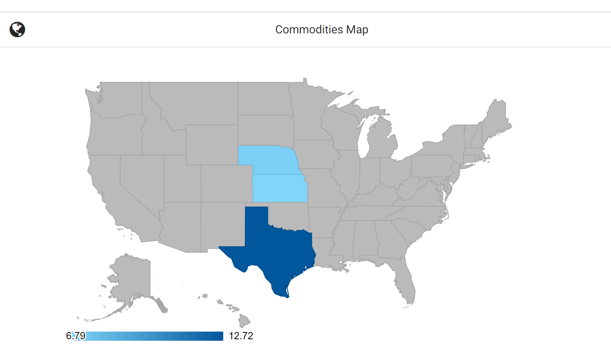
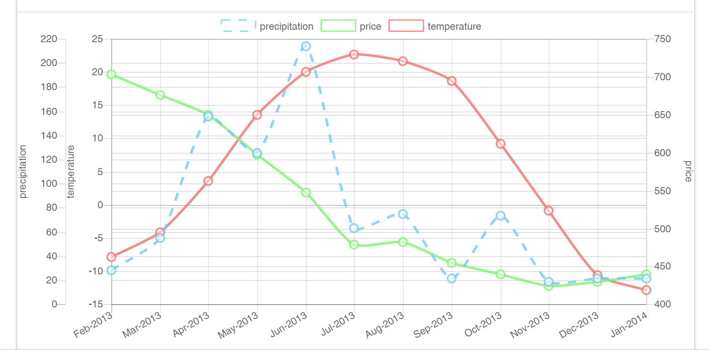

# Comm weather
Site is hosted in both:
[Heroku](http://commweather.herokuapp.com/) and [Github Pages](https://aldo-sanchez.github.io/Weather-Commodities-App/)

This project was completed as a project assignment for the UT Coding Bootcamp, in collaboration with:

+ [Alejandro Harb](https://github.com/alejandroharb)
+ [Daniel Switzer](https://github.com/Danielswitzer)
+ [Fred Nguyen](https://github.com/frednguyen)

## Synopsis
This tool can be utilized to visualize historical weather data and commodities futures prices.  
User can select commodity, one of top three producing regions, and date range for visualization. Visualization is available in a chart.js line plot with three y-axis (temperature and precipitation on the left side and price on the right side) see example below.  

Currently, data available are monthly average temperature, precipitation (top three producing regions per commodity), and commodity price for the following commodities:
+ corn
+ soybean
+ wheat
+ cotton
+ cattle

## Data Gathering and Storage:
This tool uses two APIs for data gathering:

1. [NOAA](https://www.ncdc.noaa.gov/cdo-web/webservices/v2) for GSOM historical average data sets
2. [Quandl] for commodity futures historical pricing

Data from APIs is stored in [Google's Firebase](https://firebase.google.com/) for future use.

## Charting Tools
1. [Chart.js](http://www.chartjs.org/) is used to create a line graph of price and weather data over a range of time.
2. [Google’s Geo Chart](https://developers.google.com/chart/interactive/docs/gallery/geochart) is used to display and select US top producers of a specified commodity.

## CSS and Javascript Libraries
+ [Materialize CSS](http://materializecss.com/)
+ [JQuery](http://jquery.com/)
+ [Moment.js](http://momentjs.com/) 

## Icons
This project used icons from the following sources:
+ [Google Material Icons](https://material.io/icons/)
+ [Font Awesome](http://fontawesome.io/)
+ [The Noun Project](https://thenounproject.com/) 

Additional credit is due to the fantastic artists from the Noun Project who created the icons below:
+ States and US dot maps: [anbileru adaleru](https://thenounproject.com/pronoun/collection/world-maps-dots/)
+ Cattle: [Sascha Elmers](https://thenounproject.com/saschaelmers/)
+ Corn: [Creative Stall](https://thenounproject.com/search/?q=corn&i=178924)
+ Cotton: [Alice Noir](https://thenounproject.com/AliceNoir/)
+ Wheat: [Edward Boatman](https://thenounproject.com/edward/)
+ Soybean: [anbileru adaleru](https://thenounproject.com/pronoun/collection/vegetables-and-fruits-glyphs/)
